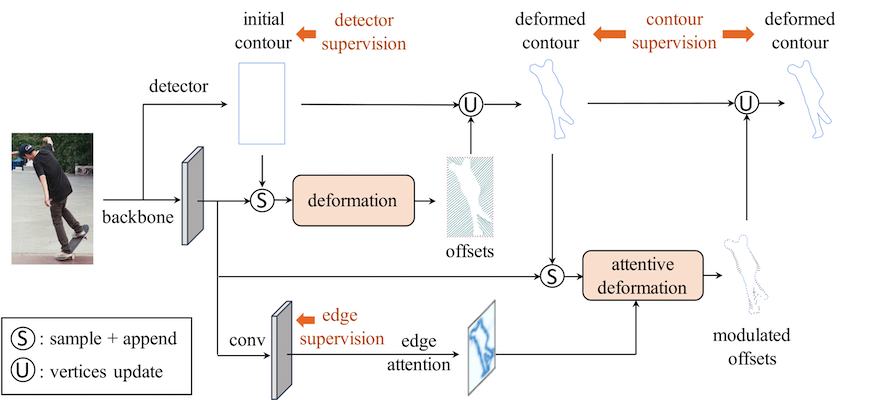

# dance


|  |  |
| :------------------------: | :------------------: |
|     *DANCE's Pipeline*     |    *Illustration*    |

### *note*
The codes in `master` branch are mainly for experiments on COCO; if you want to have a look on the codes for experiments on SBD / Cityscapes, welcome to checkout the `snake` branch, which is developed based on [the codebase of previous art](https://github.com/zju3dv/snake).

## Get started
1. Prepare the environment (the scripts are just examples)
   - gcc & g++ ≥ 5
   - Python 3.6.8 (developed & tested on this version)
     - `conda create --name dance python==3.6.8`
     - `conda deactivate && conda activate dance`
   - PyTorch 1.4 with CUDA 10.1
     - `conda install pytorch==1.4.0 torchvision==0.5.0 cudatoolkit=10.1 -c pytorch`
2. Clone this project and install framework / package dependency
   - clone dance and install dependencies: `git clone https://github.com/lkevinzc/dance && cd dance && pip install -r requirements.txt && cd ..`
   - clone Detectron2 and install v0.1: `git clone https://github.com/facebookresearch/detectron2.git && cd detectron2 && git checkout 1a7daee064eeca2d7fddce4ba74b74183ba1d4a0 && python -m pip install -e . && cd ..`
   - install cpp utils: `cd dance/core/layers/extreme_utils && export CUDA_HOME="/usr/local/cuda-10.1" && python setup.py build_ext --inplace`
   - install pycocotools: `pip install cython; pip install 'git+https://github.com/cocodataset/cocoapi.git#subdirectory=PythonAPI'`
3. Prepare dataset
   - Download form [COCO official website](https://cocodataset.org/#download)
   - put it at `dance/datasets/coco`
4. Download pre-trained model (metrics on COCO test-dev)

|  model name   |  AP   | AP50  | AP75  |                                          weights                                           |
| :-----------: | :---: | :---: | :---: | :----------------------------------------------------------------------------------------: |
| dance_r50_3x  | 36.8  | 58.5  | 39.0  | [link](https://drive.google.com/file/d/1oh0ZkBgnYu6t4dlPNlfxEnhWruA87DIt/view?usp=sharing) |
| dance_r101_3x | 38.1  | 60.2  | 40.5  | [link](https://drive.google.com/file/d/1H5eyu06qBpyw-We7CYEs4IxpdZvouJBo/view?usp=sharing) |

 *note*: put them under `output/`

## Evaluation
```bash
python train_net.py --config-file configs/Dance_R_50_3x.yaml --eval-only MODEL.WEIGHTS ./output/r50_3x_model_final.pth

python train_net.py --config-file configs/Dance_R_101_3x.yaml --eval-only MODEL.WEIGHTS ./output/r101_3x_model_final.pth
```

## Discussion
Any discussion or suggestion is welcome! Feel free to contact the author via `liuzichen@u.nus.edu`  :)

## Citation
If you find this project helpful for your research, please consider citing using BibTeX below:
```tex
@InProceedings{liu2021dance,
    author    = {Liu, Zichen and Liew, Jun Hao and Chen, Xiangyu and Feng, Jiashi},
    title     = {DANCE: A Deep Attentive Contour Model for Efficient Instance Segmentation},
    booktitle = {Proceedings of the IEEE/CVF Winter Conference on Applications of Computer Vision (WACV)},
    month     = {January},
    year      = {2021},
    pages     = {345-354}
}
```

